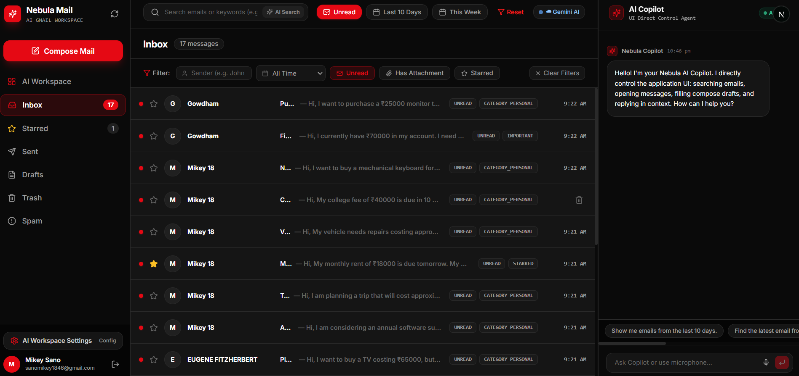
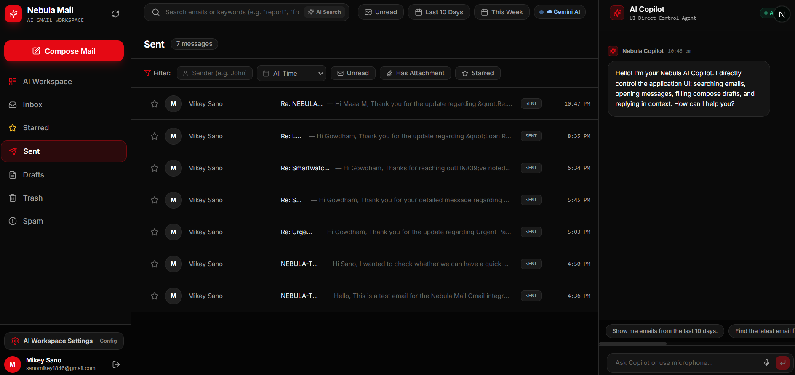
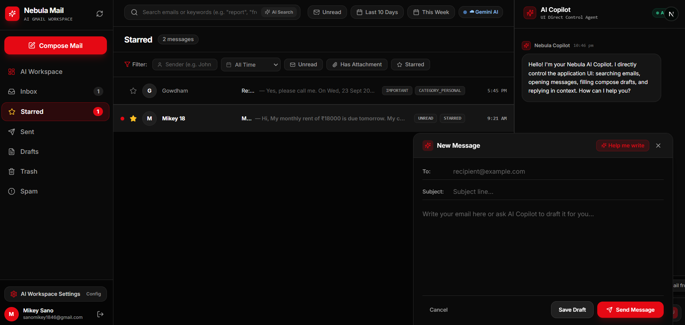
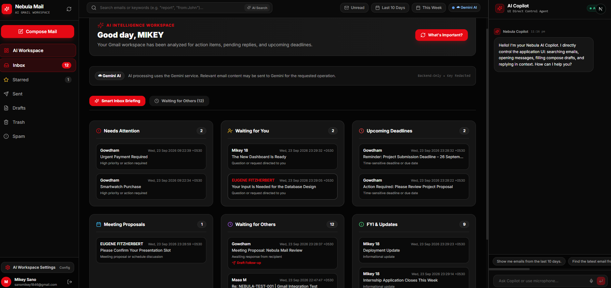
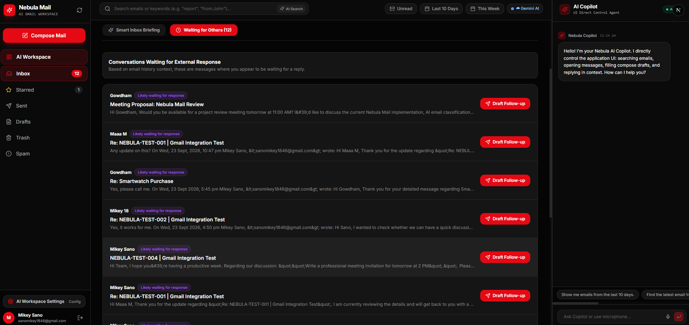

# Nebula Mail — AI-First Gmail Workspace

<p align="center">
  <strong>An AI-powered Gmail workspace where natural-language commands control real email operations through an interactive user interface.</strong>
</p>

<p align="center">
  
  
  
  
  
</p>

---

## Overview

**Nebula Mail** is a full-stack, AI-first Gmail workspace that combines the familiar email experience with natural-language assistance.

The application connects to a real Gmail account using **Google OAuth 2.0** and the **Gmail API**. Users can manage their mailbox, search emails, open conversations, compose messages, generate replies, and perform common email operations through both traditional controls and an AI Assistant.

The main objective is not to build a chatbot that only returns text. Instead, Nebula Mail allows the AI Assistant to understand a user's request and interact with the application's email interface and backend operations.

### Core interaction flow

```text
User's Natural-Language Request
              ↓
      AI Intent Detection
              ↓
      Action / Tool Planning
              ↓
       Email Operation
              ↓
       UI State Update
              ↓
       Gmail API / Mail Data
```

For example, when a user asks:

```text
Show unread emails from this week
```

the Assistant interprets the request, applies the required filters, retrieves the relevant Gmail messages, and updates the main email interface.

---

## Demo

### Complete Project Demonstration

The project walkthrough demonstrates:

- Google authentication
- Gmail inbox and email management
- Sent, Starred, Drafts, Trash, and Spam sections
- AI Workspace
- AI-generated replies
- Reply review and rewriting
- AI Copilot
- Natural-language email interaction
- AI-assisted email composition
- Draft creation and review
- Nebula Controller

**Demo video:**

[[Watch the Nebula Mail Demo](./media/demo/nebula-mail-demo.mp4)
](https://youtu.be/g6SDPQyWpn0)

---

# Key Features

## 1. Real Gmail Integration

Nebula Mail works with actual Gmail data rather than relying only on static sample emails.

Supported operations include:

- Gmail authentication through Google OAuth 2.0
- Inbox viewing
- Sent email viewing
- Starred email viewing
- Draft management
- Trash and Spam sections
- Email search
- Email detail view
- Conversation/thread viewing
- Message actions
- Draft creation
- Email sending

The application uses server-side API routes to communicate with Gmail and keeps sensitive credentials outside the frontend.

---

## 2. AI Assistant Controls the Application UI

The AI Assistant is designed to perform email operations rather than simply generate conversational answers.

Users can express requests such as:

```text
Find recent emails
```

```text
Find the earliest emails
```

```text
Show unread emails from this week
```

```text
Open the latest email
```

```text
Search my emails
```

```text
Create an email
```

The Assistant translates the request into an appropriate action and updates the relevant part of the application.

### Example interaction

```text
User:
Show unread emails from this week

Assistant:
Understands the date and unread filters

Application:
Updates the inbox using the correct Gmail query and filters
```

This creates a connection between:

```text
Natural Language
      ↓
AI Reasoning
      ↓
Action Selection
      ↓
Application State
      ↓
Gmail Data
```

The AI interaction is therefore connected to the actual mail interface.

---

## 3. Natural-Language Search and Filtering

Users can search and filter their mailbox through natural-language instructions.

Supported types of requests include:

- Search by sender
- Search by subject
- Search by keyword
- Search by date range
- Find unread emails
- Find recent emails
- Find oldest or earliest emails
- Find emails with attachments
- Combine multiple search conditions

Examples:

```text
Find emails from a specific sender
```

```text
Show emails containing the word invoice
```

```text
Find unread emails from this week
```

```text
Show the oldest emails in my inbox
```

The Assistant converts the request into the appropriate search or filtering operation and updates the main email view.

---

## 4. Navigate and Open Emails Using AI

The Assistant can help users locate and open emails through natural-language commands.

Example:

```text
Open the latest email
```

The system identifies the relevant message and opens it in the email-detail interface.

This reduces the need for users to manually search through the mailbox.

---

## 5. Context-Aware Email Replies

Nebula Mail uses the currently selected email or conversation as context for AI-assisted replies.

When a user opens an email and requests a reply, the application can use the selected message or thread to generate a relevant response.

The reply workflow supports:

- Selecting an email
- Opening the reply interface
- Generating a contextual response
- Choosing a reply style
- Reviewing the generated content
- Editing the response
- Rewriting the response
- Saving the result as a draft
- Sending after user confirmation

The main reply modes are:

- **Brief**
- **Detailed**

Example:

```text
Reply to this email and keep the response brief
```

The user can review and modify the generated response before sending it.

---

## 6. AI-Assisted Email Composition

Users can create an email by providing a simple instruction instead of writing the complete message manually.

The AI Compose feature can generate:

- Email subject
- Email body

Example:

```text
Create an email requesting an update about my project
```

The generated email can then be:

- Reviewed
- Edited
- Rewritten
- Shortened
- Expanded
- Saved as a draft
- Sent after confirmation

The user remains responsible for reviewing the final message.

---

## 7. Draft Management

Nebula Mail integrates AI-assisted writing with the normal Gmail draft workflow.

Users can:

1. Open the compose window.
2. Provide an instruction to the AI.
3. Generate the subject and body.
4. Review or edit the content.
5. Save the email as a draft.
6. Open the draft later.
7. Continue editing or send the email.

This allows AI-generated content to fit naturally into the existing email workflow.

---

## 8. Conversation and Thread Support

Nebula Mail supports working with email conversations rather than treating every message as an isolated item.

Thread-aware features include:

- Viewing conversation history
- Reading multiple messages in a thread
- Generating contextual replies
- Summarizing conversations
- Extracting action items
- Detecting important information from the thread

Using conversation context helps the AI understand the discussion before generating a response or summary.

---

## 9. AI Thread Summaries and Insights

Nebula Mail can assist users in understanding longer conversations.

The AI insight workflow can identify information such as:

- Short summary
- Main topic
- Important decisions
- Action items
- People involved
- Possible deadlines
- Suggested next steps

This is useful when users need to understand a long email conversation quickly.

---

## 10. Multi-Step AI Workflows

The Assistant supports multi-step email workflows.

For example:

```text
Find unread emails from a sender,
summarize them,
and prepare a reply to the most important one.
```

The AI can interpret the request as a sequence of operations.

A typical workflow is:

```text
1. Search for matching emails
2. Read the relevant messages
3. Summarize the content
4. Identify the important message
5. Prepare a reply
6. Ask the user to review the result
```

This approach allows complex tasks to be broken into smaller, understandable operations.

---

## 11. Human-in-the-Loop Safety

Nebula Mail separates read-only operations from actions that can affect the user's mailbox or communicate externally.

### Read-only operations

Examples:

- Searching emails
- Reading messages
- Opening threads
- Generating summaries
- Extracting action items
- Detecting follow-ups

### Actions requiring user confirmation

Examples:

- Sending an email
- Deleting messages
- Modifying labels
- Performing bulk changes
- Other external or destructive actions

This design helps prevent an AI-generated plan from performing important actions without user approval.

---

## 12. Real-Time Mail Synchronization

Nebula Mail supports mailbox synchronization using:

- Server-Sent Events
- Gmail synchronization
- Polling fallback

The application can update the interface when new messages are detected without requiring the user to manually refresh the page.

During local development, polling can be used when a publicly accessible Gmail push-notification endpoint is not available.

---

## 13. Undo Send

Nebula Mail provides an undo workflow for outgoing messages.

After initiating a send action, the user has a short period in which they can select:

```text
Undo
```

to cancel the outgoing action before it is submitted to Gmail.

---

## 14. Voice Input

The AI Assistant supports voice input through the browser's **Web Speech API**, where the browser provides support.

This allows users to interact with the Assistant using spoken instructions.

---

# Hiring Task Requirement Coverage

| Hiring Task Requirement | Nebula Mail Implementation |
|---|---|
| Real mail provider integration | Google OAuth 2.0 and Gmail API |
| Inbox and Sent views | Gmail-backed Inbox and Sent sections |
| Email detail view | Message and conversation detail interface |
| Compose and send | Compose drawer with editable fields and send workflow |
| AI-assisted composition | Natural-language instruction generates subject and body |
| AI controls compose UI | Assistant-driven compose and content generation |
| Natural-language search | AI Copilot interprets mailbox search requests |
| Filter and update main UI | Search and filter actions update the email interface |
| Navigate and open email | Assistant can locate and open relevant messages |
| Context-aware reply | Selected email or thread is used as reply context |
| Date filtering | Date-based search and filtering |
| Sender filtering | Sender-based search and filtering |
| Keyword filtering | Keyword and subject search |
| Read/unread filtering | Unread email filtering |
| Real-time synchronization | SSE-based updates with polling fallback |
| Human confirmation | Confirmation for important external or destructive actions |
| Thread support | Conversation-aware email viewing and AI operations |
| Testing | Automated tests for core AI and mail-related logic |
| Polished interface | Gmail-style workspace with AI-focused sections |

---

# System Architecture

```text
┌─────────────────────────────────────────────────────────────┐
│                         NEBULA MAIL                         │
│                    Next.js / React UI                       │
├─────────────────────────────────────────────────────────────┤
│                                                             │
│ Inbox       Threads       AI Copilot       AI Compose       │
│ Search      Drafts        Assistant        AI Reply         │
│ Filters     Actions       Explorer         Workspace        │
│                                                             │
└──────────────────────────────┬──────────────────────────────┘
                               │
                               │ API Routes / SSE
                               ▼
┌─────────────────────────────────────────────────────────────┐
│                       APPLICATION BACKEND                   │
├─────────────────────────────────────────────────────────────┤
│                                                             │
│ Google OAuth       AI Service       Action Planner           │
│ Authentication     Tool Logic       Workflow Execution      │
│                                                             │
│ Mail Provider Interface      Real-Time Synchronization       │
│                                                             │
└──────────────────────────────┬──────────────────────────────┘
                               │
                ┌──────────────┴──────────────┐
                ▼                             ▼
       ┌─────────────────┐           ┌─────────────────┐
       │ Gmail Provider  │           │ Demo Provider   │
       ├─────────────────┤           ├─────────────────┤
       │ Gmail API       │           │ Seed/Test Data   │
       └─────────────────┘           └─────────────────┘
                              
                               ▼
                    ┌──────────────────────┐
                    │      AI Layer        │
                    ├──────────────────────┤
                    │ Cloud AI / Local AI  │
                    │ Intent Detection     │
                    │ Planning             │
                    │ Content Generation   │
                    └──────────────────────┘
```

---

# Technology Stack

| Technology | Purpose |
|---|---|
| Next.js | Full-stack web application framework |
| React | Interactive user interface |
| TypeScript | Type-safe application development |
| Tailwind CSS | UI styling |
| Gmail API | Real Gmail integration |
| Google OAuth 2.0 | Authentication and authorization |
| Server-Sent Events | Real-time client updates |
| AI Service Layer | Intent detection, planning, and content generation |
| Vitest | Automated testing |
| Web Speech API | Voice input |

---

# API Endpoints

| Endpoint | Method | Purpose |
|---|---:|---|
| `/api/mail/sync` | `GET` | Mail synchronization and real-time updates |
| `/api/mail/messages` | `GET` | Retrieve messages using search and filter parameters |
| `/api/mail/thread/[id]` | `GET` | Retrieve a complete email thread |
| `/api/ai/compose` | `POST` | Generate a new email |
| `/api/ai/reply` | `POST` | Generate a contextual reply |
| `/api/ai/thread-summary` | `POST` | Summarize an email thread |
| `/api/ai/insights` | `POST` | Extract insights and action items |

---

# Screenshots

## Gmail Inbox



## AI Workspace



## AI Copilot



## AI Compose



## Nebula Controller



---

# Getting Started

## Prerequisites

Install the following before running the project:

- Node.js
- npm
- A Google Cloud project
- Google OAuth 2.0 credentials
- Gmail API enabled for the Google Cloud project
- Required AI provider credentials, if applicable

## 1. Clone the repository

```bash
git clone <your-private-repository-url>
cd Nebula
```

## 2. Install dependencies

```bash
npm install
```

## 3. Configure environment variables

Create a file named `.env.local` in the project root.

Example:

```env
# Google OAuth
GOOGLE_CLIENT_ID="your-google-client-id.apps.googleusercontent.com"
GOOGLE_CLIENT_SECRET="your-google-client-secret"
NEXTAUTH_SECRET="your-nextauth-secret"
NEXTAUTH_URL="http://localhost:3000"

# AI configuration
GEMINI_API_KEY="your-ai-api-key"
AI_PROVIDER="gemini"

# Optional local AI configuration
OLLAMA_BASE_URL="http://localhost:11434"
OLLAMA_MODEL="qwen2.5:3b"
```

> Use the exact variable names expected by the implementation.

## 4. Start the development server

```bash
npm run dev
```

Open the application at:

```text
http://localhost:3000
```

---

# Google OAuth Configuration

Configure Google OAuth 2.0 in Google Cloud Console.

For local development, add the appropriate redirect URI:

```text
http://localhost:3000/api/auth/callback/google
```

The following services and permissions must be configured according to the application's authentication flow:

- Google OAuth consent screen
- OAuth client credentials
- Gmail API
- Authorized redirect URI
- Required Gmail scopes

Never commit OAuth secrets, access tokens, refresh tokens, or API keys to the repository.

---

# Testing and Validation

Run the automated test suite:

```bash
npm test
```

Run TypeScript validation:

```bash
npx tsc --noEmit
```

Build the application:

```bash
npm run build
```

Before submission, manually verify the complete workflow:

```text
Google Login
   ↓
Inbox
   ↓
Open Email
   ↓
AI Reply
   ↓
AI Copilot Search
   ↓
Apply Filters
   ↓
AI Compose
   ↓
Save Draft
   ↓
Open Draft
   ↓
Send Email
   ↓
Sent
```

---

# Architecture Decisions and Trade-Offs

## Gmail API Instead of Only Mock Data

The application uses the Gmail API so that users can work with real mailbox data.

A provider abstraction also allows demo or testing data to be used during development.

## OAuth Instead of Password Collection

Google OAuth 2.0 is used instead of collecting or storing Gmail passwords.

Sensitive credentials are stored through environment variables and handled on the server side.

## AI Action Layer

The AI Assistant is separated from the email interface through an action and tool layer.

This allows natural-language requests to be translated into structured application operations.

## SSE with Polling Fallback

Server-Sent Events provide a way to send updates from the server to the client.

A polling fallback is useful during local development when a public Gmail push-notification endpoint is unavailable.

## Human Confirmation

Important actions such as sending or deleting messages require user confirmation.

This reduces the risk of unintended external or destructive operations.

## Thread-Based Context

Thread-aware operations use conversation history instead of relying only on the latest message.

This improves the context available for:

- Replies
- Summaries
- Follow-up detection
- Action-item extraction

---

# Security Considerations

The following information must never be committed to GitHub:

- `.env.local`
- Google client secrets
- AI API keys
- OAuth access tokens
- OAuth refresh tokens
- Session secrets
- Passwords
- Private credentials

Before pushing the repository, verify that sensitive files are ignored by Git.

---

# Future Improvements

Potential future improvements include:

1. **Production Gmail Push Notifications**  
   Use a production-ready Google Pub/Sub notification workflow instead of relying primarily on polling.

2. **Semantic Email Search**  
   Add vector-based retrieval for more advanced searches across historical messages.

3. **Attachment Intelligence**  
   Support analysis of PDFs, DOCX files, images, invoices, receipts, and contracts.

4. **Calendar Integration**  
   Convert detected meeting proposals and deadlines into calendar events.

5. **AI Evaluation Framework**  
   Add automated evaluation for response quality, hallucination detection, tone accuracy, and action-selection accuracy.

6. **Advanced Security**  
   Add stronger token protection, audit logging, access controls, and additional monitoring.

---

# Project Structure

```text
Nebula/
│
├── app/
├── components/
├── lib/
├── public/
├── media/
│   ├── screenshots/
│   │   ├── screenshot-01.png
│   │   ├── screenshot-02.png
│   │   ├── screenshot-03.png
│   │   ├── screenshot-04.png
│   │   └── screenshot-05.png
│   │
│   └── demo/
│       └── nebula-mail-demo.mp4
│
├── .gitignore
├── package.json
├── README.md
└── ...
```

---

# Project Summary

Nebula Mail demonstrates how an AI Assistant can be integrated into a real email application.

The project combines:

- Real Gmail integration
- Google OAuth authentication
- Natural-language email search
- AI-controlled UI actions
- Context-aware replies
- AI-assisted composition
- Conversation summaries
- Multi-step email workflows
- Human confirmation
- Real-time synchronization
- Automated testing

The central design principle is:

> **The AI Assistant should help users operate the application, not merely provide text responses.**

Nebula Mail brings traditional Gmail workflows and AI-powered interaction together in one workspace.

---

## License

This project is intended for demonstration and evaluation purposes.

Built as **Nebula Mail — AI-First Gmail Workspace**.
